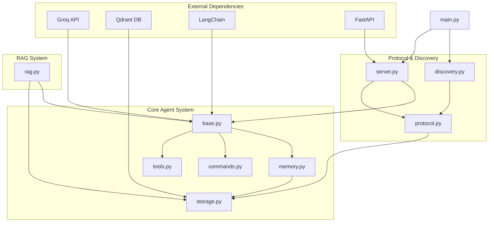
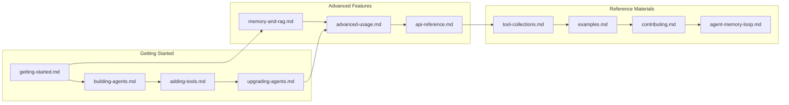
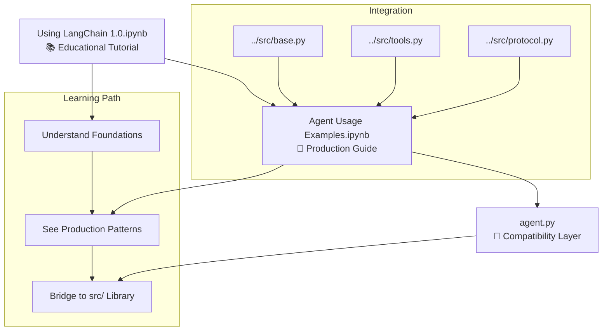
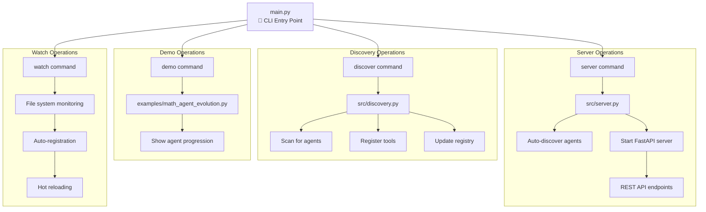

# LangChain Agent Base

**Production-ready AI agents in 3 lines of code** - A comprehensive framework for building LangChain 1.0 agents with Groq's blazing-fast inference, unified memory & RAG system, multi-agent coordination, and automatic API generation.

<div align="center">

[](https://www.python.org/downloads/)
[](https://python.langchain.com/)
[](https://groq.com/)
[](https://opensource.org/licenses/Apache-2.0)

**[🚀 Quick Start](docs/getting-started.md)** • **[🎯 Building Agents](docs/building-agents.md)** • **[🛠️ Adding Tools](docs/adding-tools.md)** • **[🧠 Memory & RAG](docs/memory-and-rag.md)** • **[📖 Full Documentation](docs/)**

</div>

## ✨ **Key Features**

- **⚡ Groq Integration** - 10x faster inference with gpt-oss-120b model
- **🎪 Specialist Agents** - Pre-built Math, Science, Coding, and domain agents  
- **🧠 Unified Memory & RAG** - Persistent conversations with smart compression and cross-system search
- **📚 Semantic Search** - Search across conversations, documents, and agent cards simultaneously
- **🤖 Multi-Agent Systems** - Coordinate teams of specialists with supervisor patterns
- **🛡️ Human-in-the-Loop** - Approval workflows for sensitive operations
- **🔧 15+ Professional Tools** - Advanced math, science, coding, and utility tools
- **⚡ Command System** - Direct tool execution bypassing LLM for speed
- **🌐 Protocol System** - Auto-generated REST APIs with versioning and metadata
- **📦 Agent Cards** - Comprehensive metadata stored in Qdrant with semantic search
- **🔍 Auto-Discovery** - Dynamic tool and agent registration with hot reloading

## 🚀 **Installation**

### 1. Clone and Setup Virtual Environment
```bash
git clone https://github.com/BlueberryMathematician/langchain-agent-base.git
cd langchain-agent-base

# Create and activate virtual environment
python -m venv .venv

# Activate virtual environment
# On Windows:
.venv\Scripts\activate
# On macOS/Linux:
source .venv/bin/activate
```

### 2. Install Dependencies
```bash
# Install all dependencies from pyproject.toml
pip install -e .

# Or install with development dependencies
pip install -e ".[dev]"
```

### 3. Set API Key
```bash
export GROQ_API_KEY="your_groq_api_key_here"
# Get free API key: https://console.groq.com/
```

### 4. Copy to Your Project (Optional)
```bash
# Copy the src/ folder to your existing project
cp -r src/ /path/to/your/project/src/

# Or use as a package dependency
pip install git+https://github.com/BlueberryMathematician/langchain-agent-base.git
```

## 💫 **Basic Usage Examples**

### Simple Agent with Memory
```python
from src.base import Agent

# Agent with persistent conversation memory
agent = Agent(enable_memory=True, memory_session_id="user_session")
response = agent.chat("What's 2 + 2?")
print(response)  # Uses built-in calculator: "2 + 2 = 4"

# Memory remembers context
follow_up = agent.chat("What did we just calculate?")  
print(follow_up)  # References previous calculation
```

### Specialized Math Agent
```python
from src.base import create_math_agent

math_agent = create_math_agent()
result = math_agent.chat("Solve x² + 5x + 6 = 0")
print(result)  # "Solutions: x₁ = -2, x₂ = -3"

# Add memory to any specialist
math_agent.enable_memory(session_id="math_project")
```

### Multi-Agent with Protocol System
```python
from src.protocol import register_agent
from src.base import Agent
from src.tools import get_science_tools

@register_agent("chemistry", version="1.0.0", domain="science")
class ChemistryAgent(Agent):
    def __init__(self):
        super().__init__(
            system_prompt="Chemistry expert with lab safety focus",
            tools=get_science_tools(),
            enable_memory=True
        )

# Automatically available via REST API and discovery
```

### Custom Tools Integration
```python
from langchain_core.tools import tool

@tool
def analyze_market_data(symbol: str) -> str:
    """Analyze financial market data for given symbol."""
    return f"Analysis for {symbol}: Bullish trend detected (+5.2%)"

agent.add_tool(analyze_market_data)
response = agent.chat("Analyze AAPL stock performance")
```

## 📁 **Complete Project Structure**

```
langchain-agent-base/
├── 📚 docs/                          # Complete documentation system
│   ├── getting-started.md            # Installation and quick start guide
│   ├── building-agents.md            # Agent creation patterns and factory functions
│   ├── adding-tools.md               # Custom tool development with @tool decorator
│   ├── upgrading-agents.md           # Agent versioning and evolution strategies
│   ├── memory-and-rag.md             # Unified memory & RAG system guide ⭐ NEW
│   ├── advanced-usage.md             # Multi-agent systems and HITL workflows
│   ├── examples.md                   # Real-world business and technical applications
│   ├── tool-collections.md           # Reference for all 15+ professional tools
│   ├── api-reference.md              # Complete class and method documentation
│   ├── agent-memory-loop.md          # Memory system architecture details
│   └── contributing.md               # Community contribution guidelines
│
├── 🧪 examples/                      # Production-ready examples and patterns
│   ├── building-ultimate-math-agent/ # Complete tutorial: Build custom agents from scratch ⭐ NEW
│   │   ├── README.md                 # Comprehensive guide with step-by-step instructions
│   │   ├── SIMPLE-EXPLANATION.md     # Beginner-friendly overview with mental models
│   │   ├── ARCHITECTURE.md           # Visual system diagrams and data flow
│   │   ├── example_calculus_tools.py # Working tool implementations
│   │   ├── example_math_agent.py     # Complete agent example
│   │   └── quick_start.py            # Automated project setup script
│   ├── math_agent_evolution.py       # Complete agent evolution (v1.0→v4.0) with versioning
│   ├── protocol_usage.py             # Protocol system demonstration with custom agents
│   ├── unified_system_demo.py        # Full system integration with memory and RAG
│   └── README.md                     # Examples guide with learning path
│
├── 📖 guide/                         # Educational notebooks and tutorials
│   ├── Using LangChain 1.0.ipynb     # Step-by-step "How to build" tutorial from scratch
│   ├── Agent Usage Examples.ipynb    # "How to use" the src/ library in production
│   └── agent.py                      # Tutorial compatibility layer and helper functions
│
├── ⚙️ src/                           # Core framework modules (copy to your project!)
│   ├── base.py                       # Agent/HITLAgent classes + create_*_agent() factories
│   ├── tools.py                      # 15+ professional tools: math, science, coding, utilities
│   ├── commands.py                   # Command system for direct tool execution (/calc, /convert)
│   ├── protocol.py                   # @register_agent decorator and metadata management
│   ├── server.py                     # Auto-generated FastAPI server with REST endpoints
│   ├── discovery.py                  # Dynamic tool/agent discovery with hot reloading
│   ├── memory.py                     # Conversation memory with smart compression ⭐ NEW
│   ├── storage.py                    # Unified Qdrant storage (agents/docs/conversations) ⭐ NEW
│   └── rag.py                        # Document indexing, retrieval, and URL management
│
├── main.py                           # CLI entry point: server, discover, demo commands
├── pyproject.toml                    # Complete dependency specification and metadata
└── README.md                         # This comprehensive guide (you are here!)
```

**🌟 New in Latest Version:**
- **Unified Memory System** - Persistent conversations with automatic compression
- **Cross-System RAG** - Search across conversations, documents, and agent cards
- **Enhanced Storage** - Single Qdrant instance for all data types with semantic search

## 📚 **Complete Documentation**

### 🚀 **Getting Started**
- **[📖 Getting Started Guide](docs/getting-started.md)** - Installation, setup, and first agent in 30 seconds
- **[🎯 Building Agents](docs/building-agents.md)** - Agent creation patterns, factory functions, and customization
- **[🛠️ Adding Tools](docs/adding-tools.md)** - Create custom tools with @tool decorator and integrate with agents
- **[📈 Upgrading Agents](docs/upgrading-agents.md)** - Agent versioning, evolution strategies, and migration patterns

### 🧠 **Advanced Features** ⭐ NEW
- **[🧠 Memory & RAG System](docs/memory-and-rag.md)** - Unified storage, conversation memory, and cross-system search
- **[⚙️ Advanced Usage](docs/advanced-usage.md)** - Multi-agent coordination, HITL workflows, and complex patterns
- **[🔧 Tool Collections](docs/tool-collections.md)** - Complete reference for all 15+ professional tools

### 📖 **Learning Resources**
- **[📝 Real-World Examples](docs/examples.md)** - Business applications, technical integrations, and use cases
- **[🔍 API Reference](docs/api-reference.md)** - Complete class documentation and method signatures
- **[🏗️ System Architecture](docs/agent-memory-loop.md)** - Memory system design and technical details

### 🧪 **Hands-On Examples**
- **[🎓 Building Ultimate Math Agent](examples/building-ultimate-math-agent/)** - Complete tutorial for using framework in your own projects ⭐ NEW
- **[📊 Math Agent Evolution](examples/math_agent_evolution.py)** - Complete agent evolution from v1.0→v4.0
- **[🌐 Protocol System Demo](examples/protocol_usage.py)** - Custom agent registration and API generation  
- **[🔗 Unified System Demo](examples/unified_system_demo.py)** - Memory, RAG, and multi-agent integration
- **[📖 Interactive Notebooks](guide/)** - Step-by-step tutorials and production usage patterns

### 🤝 **Community**
- **[🤝 Contributing Guide](docs/contributing.md)** - How to add tools, agents, and features to the framework

## 🎓 **Learning Path & Directory Guide**

### 📖 **Interactive Learning** (`guide/` directory)
- **[📔 Using LangChain 1.0.ipynb](guide/Using%20LangChain%201.0.ipynb)** - **"How to Build"**: Step-by-step tutorial showing construction of agent systems from scratch using LangChain 1.0 patterns
- **[📓 Agent Usage Examples.ipynb](guide/Agent%20Usage%20Examples.ipynb)** - **"How to Use"**: Production guide for the pre-built `src/` library with real-world patterns
- **[⚙️ agent.py](guide/agent.py)** - Tutorial compatibility layer bridging educational concepts with production code

### 🧪 **Production Examples** (`examples/` directory)  
- **[🎓 Building Ultimate Math Agent](examples/building-ultimate-math-agent/)** - Complete end-to-end tutorial for building custom agents in your own projects ⭐ NEW
- **[🧮 Math Agent Evolution](examples/math_agent_evolution.py)** - Complete v1.0→v4.0 progression with versioning and capability enhancement
- **[🌐 Protocol System Usage](examples/protocol_usage.py)** - Custom agent registration, API generation, and discovery patterns
- **[🔗 Unified System Demo](examples/unified_system_demo.py)** - Memory, RAG, and multi-agent integration showcase

### 📚 **Complete Documentation** (`docs/` directory)
- **Core Guides**: Getting started, building agents, adding tools, versioning strategies
- **Advanced Systems**: Memory & RAG integration, multi-agent coordination, HITL workflows  
- **Reference Materials**: API documentation, tool collections, architecture details, real-world examples

## 🔗 **System Integration & Connections**

### Core Framework Architecture (`src/` directory)



### Documentation System (`docs/` directory)



### Learning Resources (`guide/` directory)



### Production Examples (`examples/` directory)

```mermaid
graph TB
    subgraph "Complete Tutorial"
        A["building-ultimate-math-agent/<br/>🎓 End-to-End Guide"]
        A1["README.md"] --> A
        A2["SIMPLE-EXPLANATION.md"] --> A
        A3["ARCHITECTURE.md"] --> A
        A4["example_calculus_tools.py"] --> A
        A5["example_math_agent.py"] --> A
        A6["quick_start.py"] --> A
    end
    
    subgraph "Agent Evolution"
        B["math_agent_evolution.py<br/>🧮 v1.0→v4.0 Progression"]
    end
    
    subgraph "Protocol System"
        C["protocol_usage.py<br/>🌐 Registration & API Demo"]
    end
    
    subgraph "Unified System"
        D["unified_system_demo.py<br/>🔗 Memory+RAG+Protocol"]
    end
    
    subgraph "Dependencies"
        E["../src/base.py"] --> A
        E --> B
        E --> C
        E --> D
        F["../src/protocol.py"] --> C
        F --> D
        G["../src/memory.py"] --> D
        H["../src/storage.py"] --> D
        I["../src/tools.py"] --> A
        I --> B
        I --> C
    end
    
    J["README.md<br/>📖 Examples Guide"] --> A
    J --> B
    J --> C
    J --> D
```



### CLI & Entry Points Integration



### 🎯 **Learning → Production Pipeline**

1. **📖 Start with Documentation** - Read [Getting Started Guide](docs/getting-started.md) for overview
2. **🎓 Learn with Notebooks** - Use [Using LangChain 1.0.ipynb](guide/Using%20LangChain%201.0.ipynb) to understand foundations  
3. **🚀 See Production Usage** - Follow [Agent Usage Examples.ipynb](guide/Agent%20Usage%20Examples.ipynb) for real patterns
4. **🎯 Complete Tutorial** - Work through [Building Ultimate Math Agent](examples/building-ultimate-math-agent/) to build your own project ⭐ NEW
5. **🧪 Study Examples** - Examine [math_agent_evolution.py](examples/math_agent_evolution.py) for complete implementation
6. **🔧 Copy & Customize** - Take `src/` folder and adapt for your domain
7. **🌐 Deploy with Protocol** - Use `main.py server` for production API deployment

### 🔄 **Component Relationships**

- **`src/base.py`** ← **Core agent classes** → Used by all examples and documentation
- **`src/tools.py`** ← **Professional tools** → Referenced in guides and specialized agents  
- **`src/memory.py`** ← **Conversation memory** → Integrates with storage and enhances all agents
- **`src/storage.py`** ← **Unified Qdrant** → Serves memory, RAG, and protocol systems
- **`src/protocol.py`** ← **Agent registry** → Connects discovery, server, and storage systems
- **`examples/*.py`** ← **Production patterns** → Demonstrate integration of all src/ components
- **`guide/*.ipynb`** ← **Educational content** → Bridge theory and practice using src/ modules

## 🧠 **Memory & RAG System**

### Memory-Enhanced Agents

```python
from src.base import create_memory_enhanced_agent

# Agent with conversation memory + comprehensive tools
agent = create_memory_enhanced_agent()

# Remembers context across conversations
response1 = agent.chat("I'm working on a Python ML project")
response2 = agent.chat("What did we discuss about my project?")  # Remembers!

# Search previous conversations
response3 = agent.chat("Find our discussions about machine learning from last week")
```

### Unified Storage System

```python
from src.storage import UnifiedQdrantStorage

# Single Qdrant instance for all data types
storage = UnifiedQdrantStorage()

# Specialized storage interfaces
agent_storage = storage.get_agent_storage()         # Agent cards
memory_storage = storage.get_conversation_storage() # Chat history  
rag_storage = storage.get_rag_storage("docs")      # Documents
```

**💡 Unified System Features**:
- **Smart Compression** - Automatic conversation summarization when context exceeds limits
- **Temporal Search** - Find conversations by time range with semantic similarity
- **URL Tracking** - Link conversations to specific resources and documentation
- **Cross-System RAG** - Search across conversations, documents, and agent cards simultaneously  
- **Session Management** - Persistent memory per user/project with hierarchical organization
- **Compatible Storage** - Single Qdrant instance serves agent cards, conversations, and documents

## 🌐 **Protocol System Usage**

### Run Agent Protocol Server
```bash
# Start the auto-generated FastAPI server
python -m src.server

# API documentation available at:
# http://localhost:8000/docs
```

### Register Custom Agents
```python
from src.protocol import register_agent, AgentStatus
from src.base import Agent

@register_agent("my_domain", version="1.0.0", domain="custom")
class MySpecializedAgent(Agent):
    def __init__(self):
        super().__init__(
            system_prompt="I am specialized for my domain",
            tools=my_custom_tools()
        )

# Automatically generates API endpoints:
# POST /chat - Chat with any registered agent
# POST /command - Execute commands directly  
# GET /agents - List all registered agents
```

## 🌟 **Why Choose LangChain Agent Base?**

### 🎯 **Complete Ecosystem**
- **📁 Organized Structure** - Clear separation of docs, examples, guides, and core modules
- **🔗 Connected Systems** - Memory, RAG, protocol, and discovery work together seamlessly  
- **📖 Comprehensive Learning** - From educational tutorials to production examples
- **🔄 Evolutionary Design** - Agents can grow from simple (v1.0) to advanced (v4.0+)

### ⚡ **Production Excellence**
- **🚀 Battle-Tested Patterns** - Error handling, graceful degradation, security considerations
- **🌐 Auto-Generated APIs** - FastAPI server with OpenAPI documentation and client SDKs
- **⚡ Blazing Performance** - Groq inference is 10x faster than OpenAI for most tasks
- **🧠 Intelligent Memory** - Smart compression and cross-system search capabilities

### 🔧 **Developer Experience**  
- **🎪 Plug-and-Play Specialists** - Math, science, coding agents ready to use
- **🛠️ Extensible Architecture** - Protocol-driven design supports any domain
- **📦 Rich Metadata** - Agent cards with semantic search and version management
- **🔍 Smart Discovery** - Automatic tool and agent registration with hot reloading

### 📚 **Educational Value**
- **Step-by-Step Tutorials** - Learn LangChain 1.0 patterns from scratch
- **Real-World Examples** - Business applications and technical integrations
- **Architecture Insights** - Understand memory loops, RAG systems, and multi-agent coordination

## 🚀 **Get Started Today**

### 🎯 **Choose Your Path**

**🏃‍♂️ Quick Start** → [Getting Started Guide](docs/getting-started.md) → Agent running in 30 seconds  
**🎓 Complete Tutorial** → [Building Ultimate Math Agent](examples/building-ultimate-math-agent/) → Build your own project ⭐ NEW  
**📚 Deep Learning** → [Using LangChain 1.0.ipynb](guide/Using%20LangChain%201.0.ipynb) → Build from scratch  
**🚀 Production Ready** → [Agent Usage Examples.ipynb](guide/Agent%20Usage%20Examples.ipynb) → Use pre-built library  
**🧪 See Examples** → [Math Agent Evolution](examples/math_agent_evolution.py) → Complete implementation  
**🌐 API Server** → `python main.py server` → Auto-generated REST endpoints

### 🎪 **What You Get**

✅ **Complete Agent Framework** - From simple chat to complex multi-agent systems  
✅ **Unified Memory & RAG** - Persistent conversations with document search  
✅ **Professional Tools** - Math, science, coding, and business applications  
✅ **Protocol System** - Auto-generated APIs with versioning and discovery  
✅ **Educational Resources** - Notebooks, examples, and comprehensive docs  
✅ **Production Patterns** - Battle-tested code with error handling and security  

## 🤝 **Contributing**

We welcome contributions! See [Contributing Guide](docs/contributing.md) for:
- Adding new tools and agent types
- Improving documentation and examples  
- Enhancing the protocol system
- Building integrations and extensions

## 🙏 **Acknowledgments**

This project builds upon excellent foundational work:
- **AI Maker Space**: [LangChain 1.0 Complete Guide](https://www.youtube.com/watch?v=lSfAPNJx3xQ) and [Repository](https://github.com/AI-Maker-Space/LangChain1.0)
- **LangChain Team**: For the incredible LangChain 1.0 framework and patterns
- **Groq**: For blazing-fast inference that makes agents practical for production
- **Community Contributors**: Everyone who has added tools, examples, and improvements

---

**🌟 Ready to build the future with intelligent agents? Start your journey today!** 🚀

**📖 Documentation** • **🧪 Examples** • **🎓 Tutorials** • **🌐 Protocol System** • **🧠 Memory & RAG**