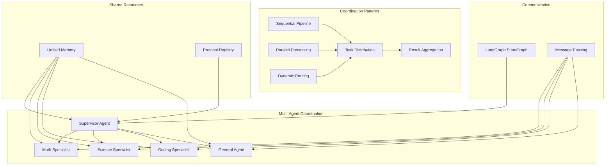

# Advanced Usage

Advanced patterns and techniques for building sophisticated AI agent systems.

## 🤖 Multi-Agent Systems

Coordinate multiple specialized agents to handle complex, multi-step tasks.

### Multi-Agent Architecture



### Basic Multi-Agent Setup

```python
from src.base import create_multi_agent_supervisor, create_math_agent, create_science_agent, create_coding_agent

# Create specialist agents
math_agent = create_math_agent()
science_agent = create_science_agent()
coding_agent = create_coding_agent()

# Create supervisor that coordinates them
supervisor = await create_multi_agent_supervisor()

# Complex query handled by multiple specialists
response = supervisor.chat(
    "Calculate the kinetic energy for a 50kg object at 10 m/s, "
    "then write Python code to calculate this for any mass and velocity"
)
```

### Custom Multi-Agent Systems

```python
from src.base import Agent
from langgraph.graph import StateGraph
from typing import Dict, List

class MultiAgentState:
    messages: List[str]
    current_agent: str
    results: Dict[str, str]

def create_custom_supervisor(agents: Dict[str, Agent]) -> Agent:
    """Create custom multi-agent coordinator."""
    
    def route_to_agent(state: MultiAgentState) -> str:
        """Determine which agent should handle the request."""
        query = state.messages[-1].lower()
        
        if any(word in query for word in ['calculate', 'math', 'equation']):
            return 'math_agent'
        elif any(word in query for word in ['convert', 'chemistry', 'physics']):
            return 'science_agent'  
        elif any(word in query for word in ['code', 'programming', 'function']):
            return 'coding_agent'
        else:
            return 'general_agent'
    
    # Build coordination graph
    workflow = StateGraph(MultiAgentState)
    
    for name, agent in agents.items():
        workflow.add_node(name, lambda state: agent.chat(state.messages[-1]))
    
    workflow.add_conditional_edges("router", route_to_agent)
    workflow.set_entry_point("router")
    
    return workflow.compile()

# Usage
agents = {
    'math_agent': create_math_agent(),
    'science_agent': create_science_agent(),
    'coding_agent': create_coding_agent(),
    'general_agent': Agent()
}

supervisor = create_custom_supervisor(agents)
```

### Sequential Agent Pipelines

```python
async def agent_pipeline(query: str) -> str:
    """Process query through multiple agents sequentially."""
    
    # Step 1: Extract requirements
    analyst = Agent(system_prompt="Extract key requirements from user queries.")
    requirements = analyst.chat(f"What are the key requirements in: {query}")
    
    # Step 2: Generate solution approach
    planner = Agent(system_prompt="Create step-by-step solution plans.")  
    plan = planner.chat(f"Create a plan for: {requirements}")
    
    # Step 3: Execute with specialist
    if 'math' in plan.lower():
        executor = create_math_agent()
    elif 'code' in plan.lower():
        executor = create_coding_agent()
    else:
        executor = create_science_agent()
    
    solution = executor.chat(f"Execute this plan: {plan}")
    
    # Step 4: Review and format
    reviewer = Agent(system_prompt="Review solutions and format them clearly.")
    final_result = reviewer.chat(f"Review and format: {solution}")
    
    return final_result

# Usage
result = await agent_pipeline("I need to calculate orbital velocity and write code for it")
```

## 🛡️ Human-in-the-Loop (HITL) Systems

Implement approval workflows for sensitive operations.

### Basic HITL Setup

```python
from src.base import HITLAgent

# Create agent requiring approval for file operations
hitl_agent = HITLAgent(
    interrupt_tools=["file_operations", "api_calls", "database_operations"],
    approval_timeout=300  # 5 minute timeout
)

# This will trigger approval workflow
response = hitl_agent.chat_with_approval(
    "Delete all log files older than 30 days",
    thread_id="session_123" 
)

# Response includes approval request
print(response["status"])  # "approval_required" 
print(response["interrupt_id"])  # "interrupt_abc123"

# Approve and continue
final_result = hitl_agent.approve_and_continue(
    thread_id="session_123",
    interrupt_id="interrupt_abc123"
)
```

### Custom Approval Logic

```python
from src.base import HITLAgent
from typing import Dict, Any

class CustomHITLAgent(HITLAgent):
    def requires_approval(self, tool_name: str, tool_input: Dict[str, Any]) -> bool:
        """Custom logic for when approval is needed."""
        
        # Always require approval for deletion
        if 'delete' in tool_input.get('action', '').lower():
            return True
            
        # Require approval for large operations  
        if tool_input.get('count', 0) > 100:
            return True
            
        # Require approval for production systems
        if 'production' in tool_input.get('environment', ''):
            return True
            
        return False
    
    def generate_approval_message(self, tool_name: str, tool_input: Dict[str, Any]) -> str:
        """Custom approval message."""
        return f"""
        🚨 APPROVAL REQUIRED 🚨
        
        Tool: {tool_name}
        Action: {tool_input}
        
        Risk Level: {"HIGH" if 'delete' in str(tool_input) else "MEDIUM"}
        
        Do you approve this action? (y/n)
        """

# Usage
custom_hitl = CustomHITLAgent()
```

### Approval Workflows with Notifications

```python
import asyncio
from typing import Callable

class NotificationHITLAgent(HITLAgent):
    def __init__(self, notification_handler: Callable = None, **kwargs):
        super().__init__(**kwargs)
        self.notification_handler = notification_handler
    
    async def request_approval(self, tool_name: str, tool_input: Dict[str, Any]) -> bool:
        """Request approval with notifications."""
        
        # Send notification
        if self.notification_handler:
            await self.notification_handler({
                'type': 'approval_request',
                'tool': tool_name,
                'input': tool_input,
                'timestamp': datetime.now().isoformat()
            })
        
        # Wait for approval (simplified)
        approval = await self.wait_for_approval()
        
        return approval

# Custom notification handler
async def slack_notification(data: Dict[str, Any]):
    """Send approval request to Slack."""
    # Implementation depends on your notification system
    print(f"Slack notification: {data}")

# Usage
notify_agent = NotificationHITLAgent(
    notification_handler=slack_notification,
    interrupt_tools=["database_operations"]
)
```

## 📚 Advanced RAG Systems

Implement sophisticated document retrieval and knowledge management.

### Multi-Collection RAG

```python
from src.rag import RAGManager

class MultiCollectionRAG:
    def __init__(self):
        self.managers = {}
    
    async def setup_collection(self, name: str, documents: List[str]):
        """Setup separate collection for specific document types."""
        manager = RAGManager()
        tools = await manager.setup_from_documents(documents, collection_name=name)
        self.managers[name] = (manager, tools)
    
    async def search_collection(self, collection: str, query: str) -> str:
        """Search specific collection."""
        if collection not in self.managers:
            return f"Collection '{collection}' not found"
        
        manager, tools = self.managers[collection]
        # Use the search tool from this collection
        return tools[0].invoke(query)
    
    async def search_all(self, query: str) -> Dict[str, str]:
        """Search all collections and return results."""
        results = {}
        for collection_name, (manager, tools) in self.managers.items():
            results[collection_name] = await self.search_collection(collection_name, query)
        return results

# Usage
multi_rag = MultiCollectionRAG()

# Setup different document collections
await multi_rag.setup_collection("contracts", ["contract1.pdf", "contract2.pdf"])
await multi_rag.setup_collection("policies", ["hr_policy.doc", "it_policy.doc"])  
await multi_rag.setup_collection("manuals", ["user_manual.txt", "admin_guide.txt"])

# Search specific collection
contract_info = await multi_rag.search_collection("contracts", "payment terms")

# Search all collections
all_results = await multi_rag.search_all("security requirements")
```

### Hierarchical RAG

```python
from src.base import Agent
from src.rag import RAGManager

class HierarchicalRAG:
    """RAG system with document hierarchy and routing."""
    
    def __init__(self):
        self.summary_agent = Agent(
            system_prompt="You are a document router. Determine which document type contains the answer."
        )
        self.collections = {}
    
    async def add_document_type(self, doc_type: str, documents: List[str], summary: str):
        """Add document type with summary for routing."""
        manager = RAGManager()
        tools = await manager.setup_from_documents(documents, collection_name=doc_type)
        
        self.collections[doc_type] = {
            'manager': manager,
            'tools': tools,
            'summary': summary
        }
    
    async def intelligent_search(self, query: str) -> str:
        """Route query to most relevant document collection."""
        
        # Create routing prompt
        collection_summaries = "\n".join([
            f"- {name}: {info['summary']}" 
            for name, info in self.collections.items()
        ])
        
        routing_prompt = f"""
        Query: {query}
        
        Available document collections:
        {collection_summaries}
        
        Which collection is most likely to contain the answer? Respond with just the collection name.
        """
        
        # Route to best collection
        best_collection = self.summary_agent.chat(routing_prompt).strip()
        
        if best_collection in self.collections:
            # Search the selected collection
            tools = self.collections[best_collection]['tools']
            return tools[0].invoke(query)
        else:
            # Fallback: search all collections
            results = []
            for name, info in self.collections.items():
                result = info['tools'][0].invoke(query)
                results.append(f"From {name}: {result}")
            return "\n\n".join(results)

# Usage
hierarchical_rag = HierarchicalRAG()

await hierarchical_rag.add_document_type(
    "legal", 
    ["contracts.pdf", "agreements.pdf"],
    "Legal documents including contracts, agreements, and terms of service"
)

await hierarchical_rag.add_document_type(
    "technical",
    ["api_docs.md", "architecture.md"], 
    "Technical documentation including API references and system architecture"
)

# Intelligent routing
result = await hierarchical_rag.intelligent_search("What are the API rate limits?")
# Routes to "technical" collection automatically
```

### RAG with Metadata Filtering

```python
from src.rag import RAGManager
import json

class MetadataRAG(RAGManager):
    """RAG with metadata-based filtering."""
    
    async def setup_with_metadata(self, documents: List[Dict[str, str]]):
        """Setup RAG with document metadata."""
        # documents = [{"content": "...", "type": "contract", "date": "2024-01-01", "department": "legal"}]
        
        processed_docs = []
        for doc in documents:
            content = doc["content"]
            metadata = {k: v for k, v in doc.items() if k != "content"}
            
            # Add metadata to document content for indexing
            enhanced_content = f"""
            {content}
            
            METADATA: {json.dumps(metadata)}
            """
            processed_docs.append(enhanced_content)
        
        return await self.setup_from_documents(processed_docs)
    
    def filter_search(self, query: str, filters: Dict[str, str]) -> str:
        """Search with metadata filters."""
        # Add filter criteria to query
        filter_text = " ".join([f"{k}:{v}" for k, v in filters.items()])
        enhanced_query = f"{query} {filter_text}"
        
        # Use regular search with enhanced query
        return self.search_tool.invoke(enhanced_query)

# Usage
metadata_rag = MetadataRAG()

documents_with_metadata = [
    {
        "content": "This contract specifies payment terms of Net 30.",
        "type": "contract",
        "department": "legal", 
        "date": "2024-01-15"
    },
    {
        "content": "HR policy states employees must use PTO for vacation.",
        "type": "policy",
        "department": "hr",
        "date": "2024-02-01"  
    }
]

await metadata_rag.setup_with_metadata(documents_with_metadata)

# Search with filters
result = metadata_rag.filter_search(
    "payment terms", 
    {"type": "contract", "department": "legal"}
)
```

## ⚡ Command Systems & Automation

Build efficient command systems for direct tool execution.

### Advanced Command Registry

```python
from src.commands import CommandRegistry, command
from typing import Dict, Any

class AdvancedCommandRegistry(CommandRegistry):
    def __init__(self):
        super().__init__()
        self.command_history = []
        self.aliases = {}
        self.macros = {}
    
    def add_alias(self, alias: str, command: str):
        """Add command alias."""
        self.aliases[alias] = command
    
    def add_macro(self, name: str, commands: List[str]):
        """Add command macro (sequence of commands)."""
        self.macros[name] = commands
    
    def execute_command(self, command_str: str, **kwargs) -> str:
        """Execute command with history and alias support."""
        # Record history
        self.command_history.append({
            'command': command_str,
            'kwargs': kwargs,
            'timestamp': datetime.now().isoformat()
        })
        
        # Check for alias
        if command_str in self.aliases:
            command_str = self.aliases[command_str]
        
        # Check for macro
        if command_str in self.macros:
            results = []
            for cmd in self.macros[command_str]:
                result = super().execute_command(cmd, **kwargs)
                results.append(f"{cmd}: {result}")
            return "\n".join(results)
        
        # Execute normal command
        return super().execute_command(command_str, **kwargs)

# Usage
registry = AdvancedCommandRegistry()

# Add aliases
registry.add_alias("c", "/calc")
registry.add_alias("s", "/solve")

# Add macros
registry.add_macro("math_check", ["/calc", "/solve", "/matrix"])

# Use aliases and macros
result = registry.execute_command("c", expression="2 + 2")  # Uses alias
result = registry.execute_command("math_check")  # Runs macro
```

### Contextual Commands

```python
from src.base import Agent

class ContextualAgent(Agent):
    """Agent that maintains context for commands."""
    
    def __init__(self, **kwargs):
        super().__init__(**kwargs)
        self.context = {}
        self.enable_commands()
    
    def set_context(self, **kwargs):
        """Set context variables."""
        self.context.update(kwargs)
    
    def execute_command(self, command: str, **kwargs) -> str:
        """Execute command with context."""
        # Merge context with command arguments
        merged_kwargs = {**self.context, **kwargs}
        return super().execute_command(command, **merged_kwargs)

# Custom contextual commands
@command("save_var", "Save variable to context", "/save_var <name> <value>")
def save_variable(name: str, value: str, agent: ContextualAgent = None) -> str:
    if agent:
        agent.set_context(**{name: value})
        return f"Saved {name} = {value}"
    return "No agent context available"

@command("use_var", "Use saved variable", "/use_var <name>")  
def use_variable(name: str, agent: ContextualAgent = None) -> str:
    if agent and name in agent.context:
        return f"{name} = {agent.context[name]}"
    return f"Variable {name} not found"

# Usage
agent = ContextualAgent()
agent.execute_command("/save_var", name="temperature", value="25")
agent.execute_command("/convert", value=25, from_unit="C", to_unit="F")  # Uses context
```

### Batch Command Processing

```python
class BatchCommandProcessor:
    """Process multiple commands in batches."""
    
    def __init__(self, agent: Agent):
        self.agent = agent
        self.batch_queue = []
    
    def add_to_batch(self, command: str, **kwargs):
        """Add command to batch."""
        self.batch_queue.append((command, kwargs))
    
    def execute_batch(self) -> List[str]:
        """Execute all commands in batch."""
        results = []
        
        for command, kwargs in self.batch_queue:
            try:
                result = self.agent.execute_command(command, **kwargs)
                results.append(f"✅ {command}: {result}")
            except Exception as e:
                results.append(f"❌ {command}: Error - {str(e)}")
        
        # Clear batch after execution
        self.batch_queue.clear()
        return results
    
    def execute_batch_parallel(self) -> List[str]:
        """Execute batch commands in parallel."""
        import concurrent.futures
        
        results = []
        with concurrent.futures.ThreadPoolExecutor() as executor:
            futures = []
            
            for command, kwargs in self.batch_queue:
                future = executor.submit(self.agent.execute_command, command, **kwargs)
                futures.append((command, future))
            
            for command, future in futures:
                try:
                    result = future.result()
                    results.append(f"✅ {command}: {result}")
                except Exception as e:
                    results.append(f"❌ {command}: Error - {str(e)}")
        
        self.batch_queue.clear()
        return results

# Usage
batch = BatchCommandProcessor(agent)

batch.add_to_batch("/calc", expression="2 + 2")
batch.add_to_batch("/convert", value=100, from_unit="F", to_unit="C") 
batch.add_to_batch("/solve", a=1, b=-5, c=6)

# Execute sequentially
results = batch.execute_batch()

# Or execute in parallel (faster)
results = batch.execute_batch_parallel()
```

## 🔧 Custom Agent Architectures

Build specialized agent architectures for specific use cases.

### ReAct Agent Pattern

```python
from src.base import Agent
import re

class ReActAgent(Agent):
    """Reasoning and Acting agent with explicit thought process."""
    
    def __init__(self, **kwargs):
        super().__init__(
            system_prompt="""You are a ReAct agent. For each query:
            1. Think: Analyze what you need to do
            2. Act: Use a tool or provide an answer
            3. Observe: Review the result
            4. Repeat if needed
            
            Format your responses as:
            Thought: [Your reasoning]
            Action: [Tool call or final answer]
            Observation: [What you learned]
            """,
            **kwargs
        )
    
    def react_chat(self, message: str, max_iterations: int = 5) -> str:
        """Chat with explicit ReAct pattern."""
        conversation = f"Query: {message}\n\n"
        
        for i in range(max_iterations):
            # Get agent response  
            response = self.chat(conversation)
            conversation += f"Step {i+1}:\n{response}\n\n"
            
            # Check if we have a final answer
            if "final answer:" in response.lower():
                # Extract final answer
                final_match = re.search(r'final answer:\s*(.*)', response, re.IGNORECASE)
                if final_match:
                    return final_match.group(1).strip()
            
            # If no final answer, continue iteration
            if i < max_iterations - 1:
                conversation += "Continue reasoning...\n"
        
        return "Could not reach a final answer within iteration limit."

# Usage  
react_agent = ReActAgent()
result = react_agent.react_chat("What's the square root of 144 plus 10% of 200?")
```

### Chain-of-Thought Agent

```python
class ChainOfThoughtAgent(Agent):
    """Agent that breaks down problems step-by-step."""
    
    def __init__(self, **kwargs):
        super().__init__(
            system_prompt="""Break down complex problems into steps:
            1. Identify the main components
            2. Solve each component
            3. Combine results
            4. Verify the answer
            
            Show your work for each step.""",
            **kwargs
        )
    
    def solve_step_by_step(self, problem: str) -> str:
        """Solve problem with explicit steps."""
        
        # Step 1: Break down the problem
        breakdown = self.chat(f"Break this problem into steps: {problem}")
        
        # Step 2: Solve each step
        solution = self.chat(f"""
        Problem: {problem}
        Steps identified: {breakdown}
        
        Now solve each step and show your work.
        """)
        
        # Step 3: Verify
        verification = self.chat(f"""
        Original problem: {problem}
        Solution: {solution}
        
        Verify this solution is correct. Check your math and reasoning.
        """)
        
        return f"""
        PROBLEM: {problem}
        
        BREAKDOWN:
        {breakdown}
        
        SOLUTION:
        {solution}
        
        VERIFICATION:
        {verification}
        """

# Usage
cot_agent = ChainOfThoughtAgent()
result = cot_agent.solve_step_by_step(
    "A car travels 60 mph for 2 hours, then 40 mph for 1.5 hours. What's the average speed?"
)
```

### Specialized Role Agents

```python
def create_role_agent(role: str, expertise: List[str], tools: List = None) -> Agent:
    """Create agent with specific role and expertise."""
    
    role_prompts = {
        "data_scientist": """You are an expert data scientist. You excel at:
        - Statistical analysis and interpretation
        - Data visualization recommendations  
        - Machine learning model selection
        - Experimental design and A/B testing
        """,
        
        "software_architect": """You are a senior software architect. You excel at:
        - System design and architecture patterns
        - Technology stack recommendations
        - Performance optimization strategies
        - Code review and best practices
        """,
        
        "business_analyst": """You are a business analyst. You excel at:
        - Requirements gathering and analysis
        - Process improvement recommendations
        - ROI analysis and business cases
        - Stakeholder communication
        """
    }
    
    system_prompt = role_prompts.get(role, f"You are a {role} expert.")
    system_prompt += f"\n\nYour areas of expertise: {', '.join(expertise)}"
    
    agent = Agent(system_prompt=system_prompt)
    
    if tools:
        agent.add_tools(tools)
    
    return agent

# Usage
data_scientist = create_role_agent(
    "data_scientist",
    ["statistics", "machine learning", "data visualization"],
    tools=get_math_tools() + get_science_tools()
)

architect = create_role_agent(
    "software_architect", 
    ["system design", "scalability", "performance"],
    tools=get_coding_tools()
)
```

## 📊 Performance Optimization

Optimize agent performance for production use.

### Response Caching

```python
import hashlib
from typing import Dict, Any

class CachedAgent(Agent):
    """Agent with response caching."""
    
    def __init__(self, cache_size: int = 1000, **kwargs):
        super().__init__(**kwargs)
        self.cache = {}
        self.cache_size = cache_size
        self.cache_hits = 0
        self.cache_misses = 0
    
    def _generate_cache_key(self, message: str, **kwargs) -> str:
        """Generate cache key for message."""
        content = f"{message}_{str(kwargs)}"
        return hashlib.md5(content.encode()).hexdigest()
    
    def chat(self, message: str, **kwargs) -> str:
        """Chat with caching."""
        cache_key = self._generate_cache_key(message, **kwargs)
        
        # Check cache
        if cache_key in self.cache:
            self.cache_hits += 1
            return self.cache[cache_key]
        
        # Get response and cache it
        response = super().chat(message, **kwargs)
        
        # Manage cache size
        if len(self.cache) >= self.cache_size:
            # Remove oldest entry (simple FIFO)
            oldest_key = next(iter(self.cache))
            del self.cache[oldest_key]
        
        self.cache[cache_key] = response
        self.cache_misses += 1
        return response
    
    def get_cache_stats(self) -> Dict[str, Any]:
        """Get cache performance statistics."""
        total = self.cache_hits + self.cache_misses
        hit_rate = self.cache_hits / total if total > 0 else 0
        
        return {
            "cache_size": len(self.cache),
            "cache_hits": self.cache_hits,
            "cache_misses": self.cache_misses,
            "hit_rate": f"{hit_rate:.2%}"
        }

# Usage
cached_agent = CachedAgent(cache_size=500)
response1 = cached_agent.chat("What's 2 + 2?")  # Cache miss
response2 = cached_agent.chat("What's 2 + 2?")  # Cache hit

print(cached_agent.get_cache_stats())
```

### Async Agent Operations

```python
import asyncio
from typing import List

class AsyncAgent(Agent):
    """Agent with async operations support."""
    
    async def chat_async(self, message: str, **kwargs) -> str:
        """Async chat method."""
        # Run synchronous chat in thread pool
        loop = asyncio.get_event_loop()
        return await loop.run_in_executor(None, self.chat, message)
    
    async def batch_chat(self, messages: List[str]) -> List[str]:
        """Process multiple messages concurrently."""
        tasks = [self.chat_async(msg) for msg in messages]
        return await asyncio.gather(*tasks)
    
    async def streaming_chat(self, message: str):
        """Simulate streaming response."""
        response = await self.chat_async(message)
        
        # Yield response in chunks (simulation)
        words = response.split()
        for i in range(0, len(words), 5):  # 5 words at a time
            chunk = " ".join(words[i:i+5])
            yield chunk
            await asyncio.sleep(0.1)  # Simulate streaming delay

# Usage
async def main():
    agent = AsyncAgent()
    
    # Async single chat
    response = await agent.chat_async("Hello!")
    
    # Batch processing
    messages = ["What's 1+1?", "What's 2+2?", "What's 3+3?"]
    responses = await agent.batch_chat(messages)
    
    # Streaming response
    async for chunk in agent.streaming_chat("Explain photosynthesis"):
        print(chunk, end=" ", flush=True)

# Run async code
asyncio.run(main())
```

### Memory Management

```python
class MemoryManagedAgent(Agent):
    """Agent with conversation memory management."""
    
    def __init__(self, max_memory_tokens: int = 4000, **kwargs):
        super().__init__(**kwargs)
        self.conversation_memory = []
        self.max_memory_tokens = max_memory_tokens
    
    def estimate_tokens(self, text: str) -> int:
        """Rough token estimation (1 token ≈ 4 characters)."""
        return len(text) // 4
    
    def manage_memory(self):
        """Trim conversation memory if needed."""
        total_tokens = sum(
            self.estimate_tokens(msg["content"]) 
            for msg in self.conversation_memory
        )
        
        # Remove oldest messages if over limit
        while (total_tokens > self.max_memory_tokens and 
               len(self.conversation_memory) > 2):  # Keep at least 2 messages
            removed = self.conversation_memory.pop(0)
            total_tokens -= self.estimate_tokens(removed["content"])
    
    def chat_with_memory(self, message: str, **kwargs) -> str:
        """Chat with managed conversation memory."""
        # Add user message to memory
        self.conversation_memory.append({
            "role": "user",
            "content": message
        })
        
        # Manage memory before processing
        self.manage_memory()
        
        # Create context from memory
        context = "\n".join([
            f"{msg['role']}: {msg['content']}" 
            for msg in self.conversation_memory[-10:]  # Last 10 messages
        ])
        
        # Get response
        response = self.chat(f"Context:\n{context}\n\nCurrent: {message}")
        
        # Add response to memory
        self.conversation_memory.append({
            "role": "assistant", 
            "content": response
        })
        
        return response

# Usage
memory_agent = MemoryManagedAgent(max_memory_tokens=2000)
```

---

**These advanced patterns enable you to build sophisticated, production-ready AI systems. Combine multiple techniques to create powerful, efficient agents tailored to your specific use cases.**