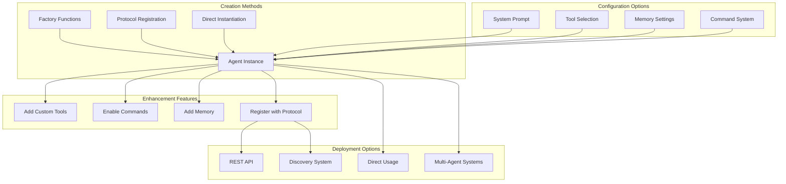

# Building Agents with LangChain Agent Base

This guide shows you how to build agents using the patterns from the **Agent Usage Examples** notebook, but in production code.

## 🚀 Quick Start

### Basic Agent (30 seconds)

The simplest way to create an agent:

```python
from src.base import Agent

# Create basic agent with default tools
agent = Agent()
response = agent.chat("What's 2 + 2?")
print(response)  # Uses built-in calculator
```

### Math Specialist Agent

Create an agent specialized for mathematical tasks:

```python
from src.base import create_math_agent

# Pre-built math agent with calculator, equations, matrices
math_agent = create_math_agent()

# Solve quadratic equations
response = math_agent.chat("Solve x² + 5x + 6 = 0")
print(response)  # "Two real roots: x₁ = -2, x₂ = -3"

# Matrix operations
response = math_agent.chat("Multiply [[1,2],[3,4]] by [[5,6],[7,8]]")
print(response)  # Matrix multiplication result

# Advanced calculations
response = math_agent.chat("Calculate sin(π/2) + log(10)")
print(response)  # Mathematical computation
```

## 🏗️ Agent Building Patterns

### Agent Creation Flow



### 1. Protocol System (Production-Ready)

Use the protocol system for versioned, API-enabled agents:

```python
from src.protocol import register_agent, AgentStatus
from src.base import Agent
from src.tools import get_math_tools, get_science_tools

@register_agent("finance_analyst", version="2.1.0", 
                domain="finance", category="specialist",
                status=AgentStatus.PRODUCTION)
class FinanceAgent(Agent):
    """Specialized financial analysis agent with market tools."""
    def __init__(self):
        super().__init__(
            system_prompt="Expert financial analyst with market data access",
            tools=get_finance_tools()  # Your custom tools
        )

# Automatically provides:
# - REST API endpoints
# - Version management 
# - Qdrant storage
# - Discovery and metadata
```

### 2. Factory Functions (Quick Start)

Use pre-built specialist agents:

```python
from src.base import (
    create_math_agent,      # Calculator, equations, matrices
    create_science_agent,   # Unit conversion, chemistry, physics
    create_coding_agent,    # Code analysis, regex, JSON
    create_simple_agent     # Basic chat agent
)

# Create specialists
math_expert = create_math_agent()
science_expert = create_science_agent() 
coding_expert = create_coding_agent()

# Each comes with relevant tools pre-loaded
print(math_expert.list_tools())    # ['advanced_calculator', 'solve_quadratic', 'matrix_operations']
print(science_expert.list_tools()) # ['unit_converter', 'chemistry_helper', 'physics_calculator']
print(coding_expert.list_tools())  # ['code_analyzer', 'regex_helper', 'json_formatter']
```

### 2. Custom Agent Class

Build your own specialized agent class:

```python
from src.base import Agent
from src.tools import get_math_tools, get_science_tools
from langchain_core.tools import tool

class DataAnalysisAgent(Agent):
    """Agent specialized for data analysis tasks."""
    
    def __init__(self):
        super().__init__(
            system_prompt="You are a data analysis expert. Use mathematical and statistical tools to analyze data and provide insights.",
            enable_commands=True  # Enable /calc, /convert commands
        )
        
        # Add relevant tool collections
        self.add_tools(get_math_tools())     # Calculator, equations
        self.add_tools(get_science_tools())  # Unit conversions, physics
        
        # Add custom data analysis tools
        self.add_tool(self._create_stats_tool())
        self.add_tool(self._create_visualization_tool())
    
    @staticmethod
    @tool
    def _create_stats_tool():
        def calculate_statistics(data: str) -> str:
            """Calculate basic statistics for a dataset."""
            # Parse data (simple implementation)
            try:
                numbers = [float(x.strip()) for x in data.split(',')]
                mean = sum(numbers) / len(numbers)
                variance = sum((x - mean)**2 for x in numbers) / len(numbers)
                std_dev = variance ** 0.5
                
                return f"""Statistics:
- Count: {len(numbers)}
- Mean: {mean:.2f}
- Variance: {variance:.2f}
- Std Dev: {std_dev:.2f}
- Min: {min(numbers)}
- Max: {max(numbers)}"""
            except Exception as e:
                return f"Error parsing data: {e}"
        
        return calculate_statistics
    
    @staticmethod 
    @tool
    def _create_visualization_tool():
        def suggest_visualization(data_description: str) -> str:
            """Suggest appropriate visualization for data."""
            description = data_description.lower()
            
            if 'time' in description or 'date' in description:
                return "Suggested: Line chart or time series plot"
            elif 'category' in description or 'group' in description:
                return "Suggested: Bar chart or pie chart"  
            elif 'relationship' in description or 'correlation' in description:
                return "Suggested: Scatter plot or correlation matrix"
            else:
                return "Suggested: Histogram for distribution analysis"
        
        return suggest_visualization

# Use your custom agent
analyst = DataAnalysisAgent()
result = analyst.chat("I have sales data: 100, 150, 200, 175, 300. Analyze this and suggest a visualization.")
print(result)
```

### 3. Modular Agent Building

Build agents by combining components:

```python
from src.base import Agent
from src.tools import advanced_calculator, unit_converter, code_analyzer

# Start with base agent
agent = Agent(
    system_prompt="You are a engineering assistant specialized in calculations and code.",
    enable_commands=True
)

# Add specific tools as needed
agent.add_tool(advanced_calculator)  # For engineering calculations
agent.add_tool(unit_converter)       # For unit conversions
agent.add_tool(code_analyzer)        # For code review

# Test the agent
response = agent.chat("Convert 100 mph to m/s, then calculate kinetic energy for 1000kg object")
print(response)
```

## 🛠️ Adding Tools to Agents

### Tool Collections

Use pre-organized tool collections:

```python
from src.tools import (
    get_basic_tools,    # Weather, magic calculator
    get_math_tools,     # Calculator, equations, matrices  
    get_science_tools,  # Unit conversion, chemistry, physics
    get_coding_tools,   # Code analysis, regex, JSON
    get_all_tools       # Everything combined
)

# Add entire collections
agent.add_tools(get_math_tools())
agent.add_tools(get_science_tools())

# Or combine multiple collections
agent.add_tools(get_basic_tools() + get_coding_tools())
```

### Individual Tools

Cherry-pick specific tools:

```python
from src.tools import (
    advanced_calculator,
    solve_quadratic, 
    unit_converter,
    chemistry_helper,
    code_analyzer
)

# Add specific tools only
agent.add_tools([
    advanced_calculator,  # For calculations
    unit_converter,       # For conversions
    code_analyzer         # For code review  
])
```

### Custom Tools

Create your own tools using the `@tool` decorator:

```python
from langchain_core.tools import tool

@tool
def database_query(sql: str) -> str:
    """Execute SQL query on the database."""
    # Your database logic here
    return f"Query result for: {sql}"

@tool
def send_email(to: str, subject: str, body: str) -> str:
    """Send email to specified recipient."""
    # Your email logic here
    return f"Email sent to {to} with subject: {subject}"

@tool
def get_stock_price(symbol: str) -> str:
    """Get current stock price."""
    # Your stock API logic here
    return f"Stock {symbol}: $150.25 (+2.3%)"

# Add to any agent
agent.add_tools([database_query, send_email, get_stock_price])
```

## 🎛️ Agent Configuration

### System Prompts

Customize agent behavior with system prompts:

```python
# Conservative financial advisor
financial_agent = Agent(
    system_prompt="""You are a conservative financial advisor. 
    Always emphasize risk management and diversification.
    Use mathematical tools to calculate returns and risks.
    Never recommend high-risk investments without warnings."""
)

# Creative coding assistant  
coding_agent = Agent(
    system_prompt="""You are a creative coding assistant.
    Help write clean, efficient code with good practices.
    Suggest improvements and optimizations.
    Always explain your reasoning."""
)

# Scientific researcher
research_agent = Agent(
    system_prompt="""You are a scientific researcher.
    Use precise terminology and cite calculations.
    Always show your work step-by-step.
    Question assumptions and suggest experiments."""
)
```

### Model Settings

Configure the underlying language model:

```python
# More creative responses
creative_agent = Agent(
    model_name="openai/gpt-oss-120b",
    temperature=0.7,  # Higher temperature = more creative
    system_prompt="You are a creative problem solver."
)

# Very focused and deterministic
precise_agent = Agent(
    model_name="openai/gpt-oss-120b", 
    temperature=0.0,  # Lower temperature = more focused
    system_prompt="You are a precise analytical assistant."
)
```

## 🎯 Testing Your Agents

### Basic Testing

```python
# Test basic functionality
def test_math_agent():
    agent = create_math_agent()
    
    # Test calculator
    result = agent.chat("What is 15 * 23?")
    assert "345" in result
    
    # Test quadratic solver
    result = agent.chat("Solve x² + 5x + 6 = 0")
    assert "x₁ = -2" in result and "x₂ = -3" in result
    
    print("✅ Math agent tests passed")

test_math_agent()
```

### Tool Testing

```python
# Test individual tools
def test_custom_tools():
    @tool
    def add_numbers(a: int, b: int) -> int:
        """Add two numbers."""
        return a + b
    
    agent = Agent()
    agent.add_tool(add_numbers)
    
    result = agent.chat("Add 5 and 7")
    assert "12" in result
    
    print("✅ Custom tool tests passed")

test_custom_tools()
```

## 🚀 Next Steps

Now that you know how to build agents:

1. **[Adding Tools](adding-tools.md)** - Learn to create custom tools
2. **[Upgrading Agents](upgrading-agents.md)** - Evolve agents over time  
3. **[Advanced Usage](advanced-usage.md)** - Multi-agent systems, RAG, HITL
4. **[Real Examples](examples.md)** - Production patterns and use cases

The math agent example is perfect for getting started - it's focused, well-defined, and has clear use cases. Start there and expand as needed!