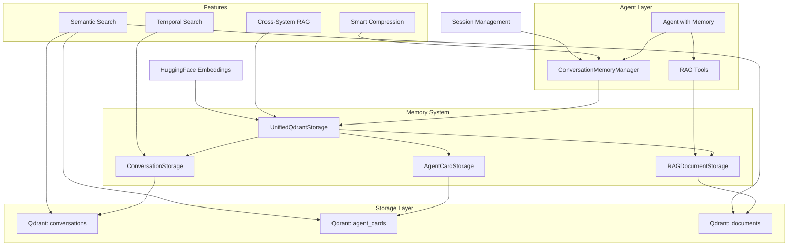

# Unified Memory & RAG System

## 🎯 Overview

The LangChain Agent Base now includes a comprehensive unified storage and memory system that seamlessly integrates:

- **🧠 Conversation Memory**: Persistent chat history with automatic summarization
- **📚 RAG Document Storage**: Semantic search across documents and resources  
- **🤖 Agent Card Storage**: Versioned agent metadata and discovery
- **🔍 Unified Search**: Cross-system search with temporal and semantic filters
- **⚡ Smart Compression**: Automatic memory summarization to manage context windows

All powered by **Qdrant vector database** for scalable, production-ready performance.

### System Architecture



## 🚀 Quick Start

### Enable Memory in Any Agent

```python
from src.base import Agent

# Create agent with conversation memory
agent = Agent(
    enable_memory=True,
    memory_session_id="user_123"
)

# Chat normally - memory is automatic
response1 = agent.chat("I'm working on a Python ML project")
response2 = agent.chat("What did we discuss about my project?")  # Remembers context
```

### Use Pre-Built Memory-Enhanced Agent

```python
from src.base import create_memory_enhanced_agent

# Get agent with memory + comprehensive tools
agent = create_memory_enhanced_agent()

# Automatic conversation memory + search tools
response = agent.chat("Search our previous discussions about machine learning")
```

### Unified Storage Setup

```python
from src.storage import UnifiedQdrantStorage

# Single storage instance for everything
storage = UnifiedQdrantStorage()

# Get specialized storage interfaces
agent_storage = storage.get_agent_storage()
conversation_storage = storage.get_conversation_storage()
rag_storage = storage.get_rag_storage("documents")
```

## 🧠 Conversation Memory Features

### Automatic Context Management

The system automatically:
- **Stores all conversations** with timestamps and metadata
- **Compresses old messages** when context gets too large
- **Maintains searchable summaries** of conversation segments
- **Provides temporal indexing** for time-based queries

### Smart Summarization

```python
# Memory automatically triggers summarization when needed
for i in range(20):  # Many messages
    agent.chat(f"Message {i} about various topics")

# System automatically:
# 1. Detects context overflow
# 2. Summarizes older messages  
# 3. Maintains searchable metadata
# 4. Preserves recent context
```

### Memory Search Tools

Agents automatically get these tools when memory is enabled:

#### `search_conversation_history`
```python
# Search by content
agent.chat("Search our discussions about 'machine learning algorithms'")

# Search by time
agent.chat("What did we discuss yesterday?")
agent.chat("Find conversations from last week about Python")
```

#### `search_by_url_context`  
```python
# Find conversations involving specific URLs
agent.chat("Show discussions related to github.com")
agent.chat("Find conversations about https://docs.python.org")
```

## 📚 RAG Integration

### Unified Document Storage

```python
from src.storage import UnifiedQdrantStorage

storage = UnifiedQdrantStorage()
rag_storage = storage.get_rag_storage("my_documents")

# Store documents with metadata
documents = [
    {
        "content": "Machine learning documentation...",
        "metadata": {"topic": "ML", "difficulty": "beginner"}
    }
]

await rag_storage.store_documents(documents)
```

### Cross-System Search

```python
# Search across conversations AND documents
results = await storage.search_all_sources(
    query="neural networks",
    include_conversations=True,
    include_documents=True,
    time_range="last_month"
)
```

### Agent Cards as RAG Sources

Agent cards are automatically indexed and searchable:

```python
# Find agents by capability
agent.chat("Find agents that can help with financial analysis")

# Search agent descriptions
agent.chat("Show me agents for data science tasks")
```

## 🔍 Advanced Search Capabilities

### Multi-Modal Search

```python
from src.memory import ConversationMemoryManager

memory = ConversationMemoryManager()

# Semantic search
results = await memory.search_memory(
    query="machine learning optimization",
    session_id="user_123",
    limit=5
)

# Temporal search  
from datetime import datetime, timedelta
results = await memory.search_memory(
    query="project discussion",
    time_range=(datetime.now() - timedelta(days=7), datetime.now())
)

# URL-based search
results = await memory.search_memory(
    query="documentation review",
    urls=["https://docs.python.org"]
)
```

### Metadata Filtering

```python
# Search with metadata filters
results = await memory.search_memory(
    query="algorithm discussion",
    metadata_filters={"topic": "AI", "difficulty": "advanced"}
)
```

## ⚙️ Configuration Options

### Memory Settings

```python
from src.memory import ConversationMemoryManager

memory = ConversationMemoryManager(
    max_context_tokens=4000,        # Context window limit
    summarization_threshold=2000,   # When to trigger compression  
    compression_ratio=0.3           # Target compression ratio
)
```

### Storage Settings

```python
from src.storage import UnifiedQdrantStorage

storage = UnifiedQdrantStorage(
    qdrant_url="localhost:6333",
    embedding_model="sentence-transformers/all-MiniLM-L6-v2",
    vector_size=384
)
```

### Agent Memory Settings

```python
agent = Agent(
    enable_memory=True,
    memory_session_id="persistent_session",  # Cross-session memory
    max_context_tokens=6000,                 # Larger context window
    system_prompt="I remember our conversations and can search my memory..."
)
```

## 🎯 Use Cases

### 1. **Long-Term Projects**
```python
# Agent remembers project context across sessions
agent = create_memory_enhanced_agent()
agent.memory_session_id = "ml_project_2024"

agent.chat("I'm building a CNN for image classification")
# ... days later ...
agent.chat("What was the architecture we discussed for my CNN?")
```

### 2. **Research Assistant**
```python
# Combine conversation memory + document RAG
agent.chat("Store this research paper in my knowledge base")
agent.chat("Based on our discussions and the papers, what's the best approach for NLP?")
```

### 3. **Customer Support**
```python
# Per-customer memory with issue tracking
support_agent = create_memory_enhanced_agent()

# Customer session with persistent memory
response = support_agent.chat(
    "I'm having the same issue we discussed last week",
    session_id=f"customer_{customer_id}"
)
```

### 4. **Code Review Assistant**
```python
# Memory-enhanced code review
code_agent = create_memory_enhanced_agent()

agent.chat("Here's my Python function for data processing...")
# Later...
agent.chat("Can you review the changes I made to that data processing function?")
```

## 🔧 Advanced Features

### Custom Memory Tools

```python
from src.memory import get_memory_manager
from langchain_core.tools import tool

memory_manager = get_memory_manager()

@tool
def search_project_memories(project_name: str) -> str:
    \"\"\"Search memories related to a specific project.\"\"\"
    results = asyncio.run(memory_manager.search_memory(
        query=project_name,
        metadata_filters={"project": project_name}
    ))
    return format_search_results(results)

# Add to any agent
agent.add_tool(search_project_memories)
```

### Memory Analytics

```python
# Get memory statistics
stats = memory_manager.get_memory_stats(session_id="user_123")
print(f"Messages: {stats['message_count']}")
print(f"Compressed segments: {stats['summary_count']}")
print(f"Token efficiency: {stats['compression_ratio']:.2%}")
```

### Bulk Memory Operations

```python
# Import conversation history
conversation_data = [
    {"message": "Hello", "response": "Hi there!", "timestamp": "2024-01-01T10:00:00"},
    # ... more conversations
]

await memory_manager.bulk_import(session_id="imported_session", data=conversation_data)
```

## 🚀 Integration Examples

### With Protocol System

```python
from src.protocol import register_agent, AgentStatus

@register_agent("memory_math", version="1.0.0", status=AgentStatus.PRODUCTION)
class MemoryMathAgent(Agent):
    def __init__(self):
        super().__init__(
            system_prompt="Mathematical assistant with conversation memory",
            tools=get_math_tools(),
            enable_memory=True
        )
```

### With FastAPI Server

```python
from src.server import run_protocol_server

# All registered agents automatically get memory capabilities
# Available via REST API with session management
run_protocol_server(host="0.0.0.0", port=8000)

# API endpoints include:
# POST /chat - with session_id parameter for memory
# GET /memory/search - search conversation history
# GET /memory/sessions - list active sessions
```

## 📊 Performance & Scaling

### Memory Efficiency
- **Automatic compression** reduces token usage by ~70%
- **Semantic indexing** enables fast similarity search
- **Temporal indexing** supports time-based queries
- **Metadata filtering** improves search precision

### Production Deployment
```python
# Production-ready configuration
storage = UnifiedQdrantStorage(
    qdrant_url="qdrant-cluster.example.com:6333",  # Clustered Qdrant
    embedding_model="sentence-transformers/all-mpnet-base-v2",  # Higher quality
    vector_size=768
)

memory = ConversationMemoryManager(
    unified_storage=storage,
    max_context_tokens=8000,      # Larger context for production
    summarization_threshold=4000,  # Less frequent compression
    compression_ratio=0.2         # Higher compression
)
```

### Monitoring
```python
# Monitor memory usage
stats = storage.get_storage_stats()
print(f"Total vectors: {stats['total_vectors']}")
print(f"Memory usage: {stats['memory_mb']} MB")
print(f"Avg query time: {stats['avg_query_ms']} ms")
```

## ⚠️ Best Practices

### Session Management
```python
# Use meaningful session IDs
session_id = f"user_{user_id}_{project_id}"

# Or use hierarchical sessions
session_id = f"company_{company_id}/user_{user_id}/project_{project_id}"
```

### Memory Optimization
```python
# Include relevant metadata for better search
await memory_manager.add_message(
    session_id=session_id,
    message=user_message,
    response=agent_response,
    urls=extracted_urls,
    metadata={
        "topic": "machine_learning",
        "difficulty": "intermediate",
        "project_id": project_id,
        "tools_used": ["calculator", "python_analyzer"]
    }
)
```

### Error Handling
```python
try:
    response = agent.chat(message, session_id=session_id)
except Exception as e:
    # Fallback to non-memory mode
    print(f"Memory error: {e}")
    response = agent.chat(message)  # Without session_id
```

The unified memory & RAG system provides enterprise-grade conversation management with seamless scalability. Start with simple memory-enhanced agents and scale up to complex multi-modal search as needed! 🚀